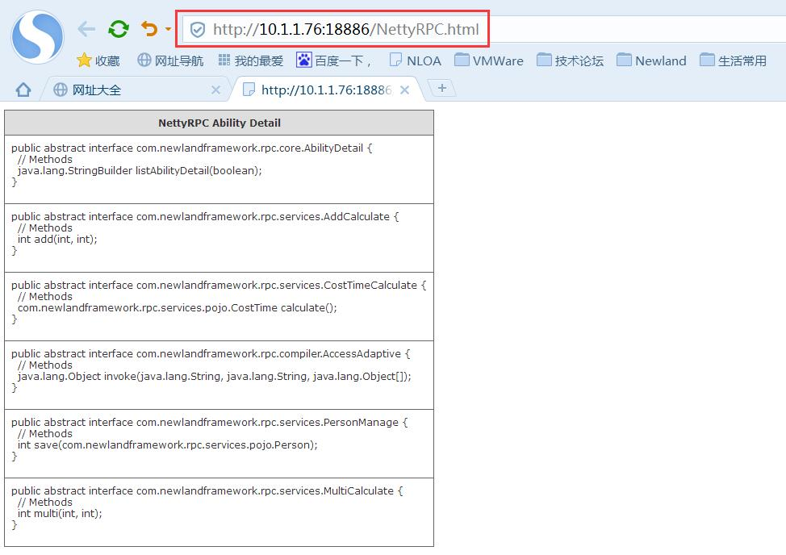

# NettyRPC Project
high performance java rpc server base on netty framework,using kryo,hessian,protostuff support rpc message serialization.

----------
## NettyRPC 1.0 Build 2016/6/25 by tangjie

### NettyRPC 1.0 中文简介：
**NettyRPC是基于Netty构建的RPC系统，消息网络传输支持目前主流的编码解码器**
* NettyRPC基于Java语言进行编写，网络通讯依赖Netty。
* RPC服务端采用线程池对RPC调用进行异步回调处理。
* 服务定义、实现，通过Spring容器进行加载、卸载。
* 消息网络传输除了JDK原生的对象序列化方式，还支持目前主流的编码解码器：kryo、hessian。
* Netty网络模型采用主从Reactor线程模型，提升RPC服务器并行吞吐性能。
* 多线程模型采用guava线程库进行封装。

### NettyRPC 1.0 English Introduction:
**NettyRPC is based on Netty to build the RPC system, the message network transmission support the current mainstream codec.**
* NettyRPC based on Java language, network communications rely on Netty.
* RPC server using the thread pool on the RPC call asynchronous callback processing.
* service definition, implementation, through the Spring container(IOC) loading, unloading.
* message network transmission in addition to JDK native object serialization mode, but also to support the current mainstream of the codec: kryo, hessian.
* Netty network model uses the master-slave Reactor thread model, to improve the performance of RPC server parallel throughput.
* multi thread model using guava thread framework.

----------
## NettyRPC 2.0 Build 2016/10/7 by tangjie

### NettyRPC 2.0 中文简介：
**NettyRPC 2.0是基于NettyRPC 1.0 在Maven下构建的RPC系统，在原有1.0版本的基础上对代码进行重构升级，主要改进点如下：**
* RPC服务启动、注册、卸载支持通过Spring中的nettyrpc标签进行统一管理。
* 在原来编码解码器：JDK原生的对象序列化方式、kryo、hessian，新增了：protostuff。
* 优化了NettyRPC服务端的线程池模型，支持LinkedBlockingQueue、ArrayBlockingQueue、SynchronousQueue，并扩展了多个线程池任务处理策略。
* NettyRPC服务端加入JMX监控支持。

### NettyRPC 2.0 English Introduction:
**NettyRPC 2.0 is based on NettyRPC 1.0 under the Maven to build the RPC system, based on the original 1.0 version of the code to refactoring, the main improvements are as follows:**
* RPC service startup, registration, uninstall support through the nettyrpc Spring tags for unified management.
* in the original codec: JDK native object serialization mode, kryo, hessian, added: protostuff.
* optimize the NettyRPC server's thread pool model, support LinkedBlockingQueue, ArrayBlockingQueue, SynchronousQueue, and expand the various thread pool task processing strategy.
* NettyRPC JMX monitoring support.

----------
## NettyRPC 2.1 Build 2017/3/23 by tangjie

**在NettyRPC 2.0的基础上新增NettyRPC异步回调功能模块：**
* 基于cglib生成异步代理Mock对象，针对一些极端耗时的RPC调用场景进行异步回调，从而提高客户端的并行吞吐量。

----------
## NettyRPC 2.2 Build 2017/5/2 by tangjie

**在2.1版本的基础上，提供NettyRPC服务端接口能力展现功能：**
* 接口能力展现功能模块部署在服务端的18886端口，可以在浏览器中输入：http://ip地址:18886/NettyRPC.html  进行查看。
* 比如在浏览器的地址栏中输入：http://10.1.1.76:18886/NettyRPC.html  查询展现如下：

* NettyRPC客户端支持重连功能：这点主要是针对RPC服务器宕机的情形下，RPC客户端可以检测链路情况，如果链路不通，则自动重连（重连重试的时间默认为10s）。

----------
## NettyRPC 2.3 Build 2017/7/28 by tangjie

**在NettyRPC 2.2的基础上新增NettyRPC过滤器功能：**
* 进一步合理地分配和利用服务端的系统资源，NettyRPC可以针对某些特定的RPC请求，进行过滤拦截。
* 具体过滤器要实现：com.newlandframework.rpc.filter.Filter接口定义的方法。
* 被拦截到的RPC请求，NettyRPC框架会抛出com.newlandframework.rpc.exception.RejectResponeException异常，可以根据需要进行捕获。
* spring配置文件中的nettyrpc:service标签，新增filter属性，用来定义这个服务对应的过滤器的实现。当然，filter属性是可选的。

----------
## NettyRPC相关博客文章
if you want to know more details,okey!you can see my blog:

**Talk about how to use Netty nio frameworks development high performance RPC server**

**谈谈如何使用Netty开发实现高性能的RPC服务器**

http://www.cnblogs.com/jietang/p/5615681.html

**By Netty to realize high performance RPC server optimization of the message serialization**

**Netty实现高性能RPC服务器优化篇之消息序列化**

http://www.cnblogs.com/jietang/p/5675171.html

**Based on Netty to develop RPC server design experience**

**基于Netty打造RPC服务器设计经验谈**

http://www.cnblogs.com/jietang/p/5983038.html

----------

## Author
唐洁（tangjie） http://www.cnblogs.com/jietang/

----------

## License
[Apache License, Version 2.0](http://www.apache.org/licenses/LICENSE-2.0.html) Copyright (C) 2016 Newland Group Holding Limited
